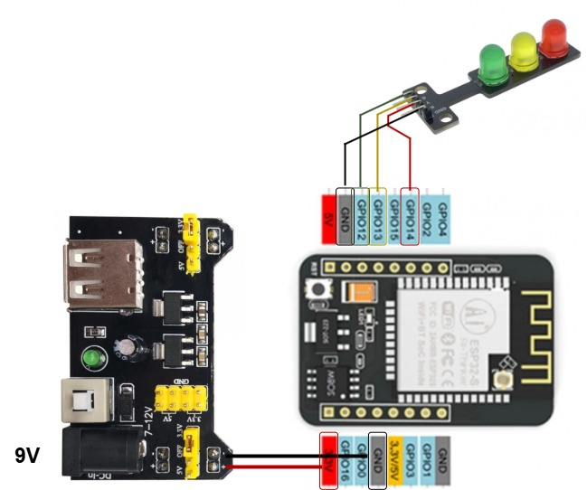

ESPHome traffic light toy
=========================

This is a fun little project - a traffic light toy that can connect to a home
automation system. The idea is to make playtime more exciting while also
sneaking in a bit of learning about traffic rules. Plus, it’s a cool way to
tinker with ESPHome for the first time.

Hardware setup
--------------

Below is the list of components used to build the traffic light toy:

- [ESP32-CAM Wi-Fi and Bluetooth Board][esp_device]:
  The development board used to control the traffic light.

- [Breadboard Power Supply Module (5V and 3.3V][power_supply]:  
  Provides power to the development board and traffic light.

- [LED Traffic Light Module][traffic_light_module]:  
  The traffic light module with red, yellow, and green LEDs.

Refer the wiring diagram on how these components are connected:



Installation & Configuration
----------------------------

On windows, install `esphome` via pip:

```sh
pip install esphome
```

Checkout the repository:

```sh
esphome.exe dashboard ./repository-name
```

Find the device as offline with the [traffic light config](traffic-light.yaml)


secret.yaml? 


[esp_device]:
    https://www.tinytronics.nl/en/development-boards/microcontroller-boards/with-wi-fi/esp32-cam-wifi-and-bluetooth-board-with-ov2640-camera

[power_supply]:
    https://www.tinytronics.nl/en/power/voltage-converters/voltage-regulators/breadboard-power-supply-5v-en-3.3v

[traffic_light_module]:
    https://www.tinytronics.nl/en/lighting/rings-and-modules/led-traffic-light-module
