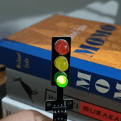

ESPHome traffic light toy
=========================

This is a fun little project - a traffic light toy that can connect to a home
automation system. The idea is to make playtime more exciting while also
sneaking in a bit of learning about traffic rules. Plus, it’s a cool way to
tinker with ESPHome for the first time.

Hardware setup
--------------

Below is the list of components used to build the traffic light toy:

- [ESP32-CAM Wi-Fi and Bluetooth Board][esp_device]: The development board used
  to control the traffic light.

- [Breadboard Power Supply Module (5V and 3.3V][power_supply]: Provides power to
      the development board and traffic light.

- [LED Traffic Light Module][traffic_light_module]: The traffic light module
      with red, yellow, and green LEDs.

- [USB to Serial (TTL level) converter][ttl_serial]: Used to program the
      `ESP32-CAM` by establishing a serial connection with your computer.

For the initial programming of the `ESP32-CAM`, connect the USB-to-serial
adapter and ensure `GPIO0` is connected to `GND` to enable flashing mode.

Refer the wiring diagram on how these components are connected:


Installation & Configuration
----------------------------

The instructions below are based on Windows OS.

Install `esphome` via pip:

```sh
pip install esphome
```

> [!TIP]
> Perform a factory reset (via serial connection):
> `esptool.exe --chip esp32 erase_flash`
>
> This fully wipes the flash memory — useful before flashing new firmware or
> fixing boot issues. It gives the ESP32 a clean slate, like a fresh start.

Checkout the repository (replace `repository-name` with the actual name of your
repository):

```sh
esphome.exe dashboard ./repository-name
```

Visit [http://localhost:6052](http://localhost:6052) to open the ESPHome
dashboard. Device must be listed offline there.


Update `secrets` and save:

```yaml
wifi_ssid: "your_wifi_ssid"
wifi_password: "your_wifi_password"
```


Begin the installation and choose the `Plug into this computer` option:


The installation process may take some time. Once completed, the setup is ready!


Restart the module after removing the connections used for the first-time
programming. It is up and running.



> [!TIP]
> Sensor interface is also now available:
> [http://traffic-light.local/](http://traffic-light.local/)

[esp_device]:
    https://www.tinytronics.nl/en/development-boards/microcontroller-boards/with-wi-fi/esp32-cam-wifi-and-bluetooth-board-with-ov2640-camera

[power_supply]:
    https://www.tinytronics.nl/en/power/voltage-converters/voltage-regulators/breadboard-power-supply-5v-en-3.3v

[traffic_light_module]:
    https://www.tinytronics.nl/en/lighting/rings-and-modules/led-traffic-light-module

[ttl_serial]:
    https://ftdichip.com/products/ttl-232r-3v3/